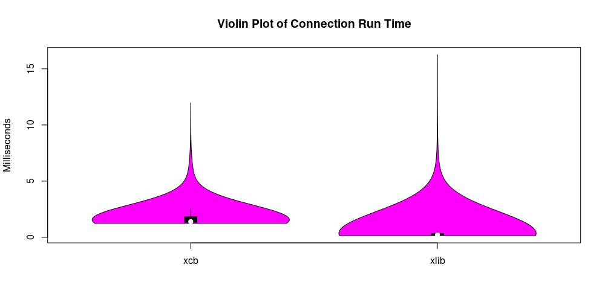
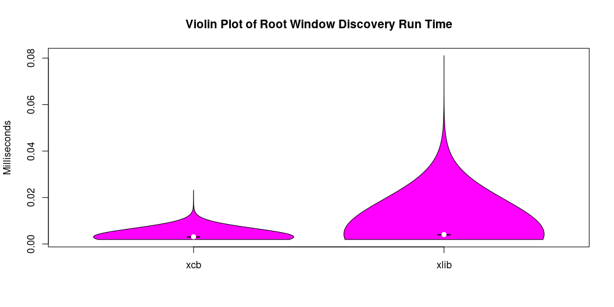
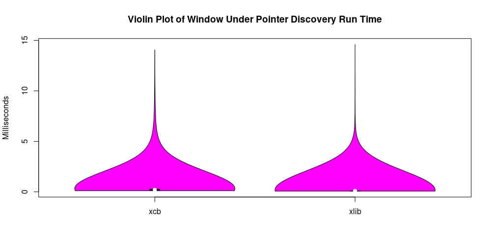
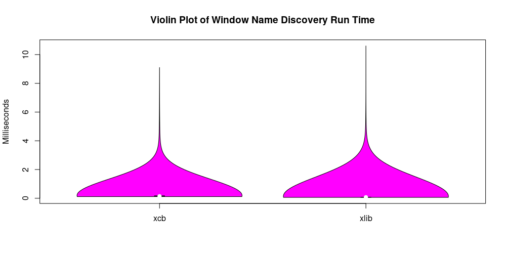
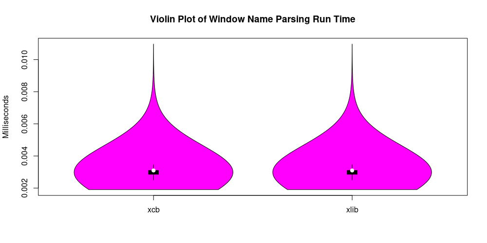
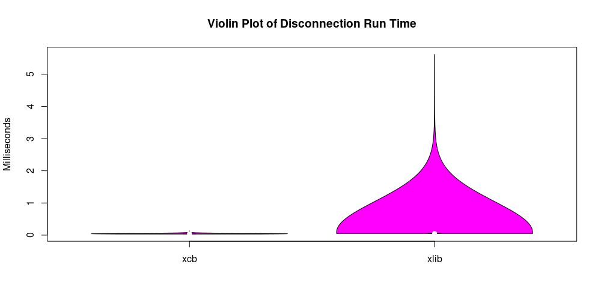
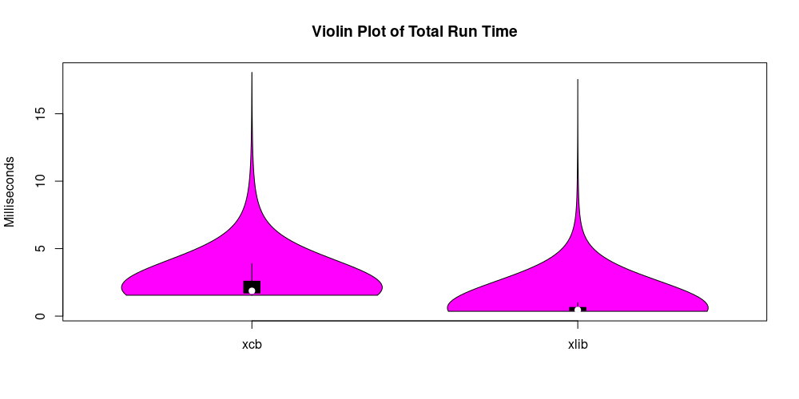
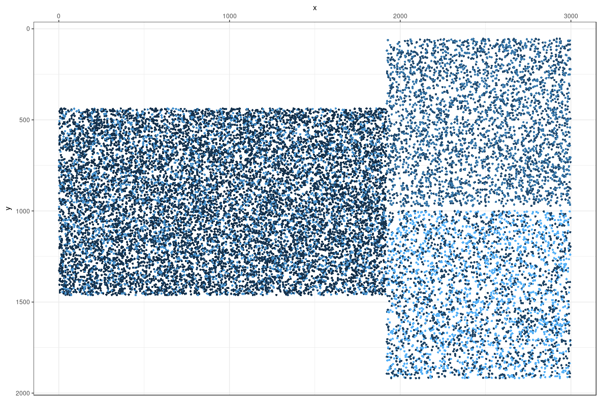

# Window Under Pointer

## Running

```sh-session
$ cd path/to/this/directory
$ ./window-under-pointer
```

[The included `R` script](process_data.R) is what I used to generate the stuff below.

## Included

I ran a quick sample of 10000 clicks per library. `Xlib` was phenomenally faster (although we're really talking fractions of a millisecond here).









## Click Map

For grins, I built this too.


